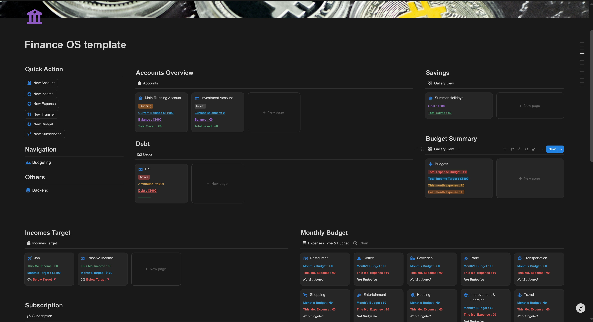
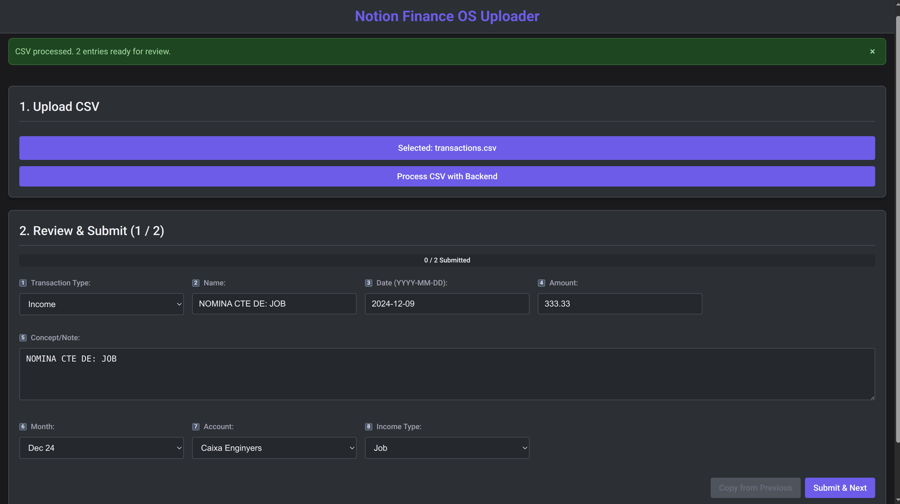

# Bank to Notion Finance OS

Some time ago, I was searching for a budgeting app to track my personal finances. However, I was extremely disappointed to see that none of the apps I found integrated with my bank. So, I modified a complex Notion template to suit my needs. It worked great at first, but after some time, having to manually add each transaction became too much friction—and I stopped using it.

After several months, with a renewed desire to stay financially aware, I decided to build the integration myself.

This project helps you **upload a bank transaction extract** (`.csv`) to a **complete Notion financial dashboard**. It **automates** the **processing** and **categorization** with a powerful, productivity-focused UI.

## Contact Me

If you have any questions, issues during setup, or need help with implementation, feel free to reach out. I'm happy to help troubleshoot, explain features, or talk about improvements.

The best way to contact me is through [LinkedIn/in/guimcc](https://www.linkedin.com/in/guimcc/) — feel free to connect and send a message. I'm always open to feedback and excited to see how others use this system!

---

## Finance OS

The current template is based on the free version of [TheUltimateFinanceTracker](https://heyismail.gumroad.com/l/TheUltimateFinanceTracker). I've simplified and tweaked the logic to better fit my needs. You can find my version [here](https://noble-sociology-0ad.notion.site/Finance-OS-template-1f5d083e48b1805cbb51d7fbbc6d48fe).



Main features of the dashboard:

- **Accounts**: Represent different places where you store money. They're central to the system.
- **Debt**: Reminders of pending payments. Expenses related to debts will update their balances.
- **Saving**: "Virtual savings" — not separate accounts, but a way to allocate money toward goals.
- **Expense Types & Budget**: Categories for expenses. Let you set financial goals and track progress.
- **Income Targets**: Set income goals by category.
- **Expenses**: Track each transaction — especially card purchases and Bizums. Includes:
  - `Subs` checkbox: For expenses that should be categorized but not count toward monthly totals.
  - `Split` checkbox: Only counts half of the amount. E.g. when splitting a bill.
- **Incomes**: Track your earnings, especially salaries or transfers.
- **Transfers**: Move money between accounts/savings or log untracked income/expenses.
  - `To Acc` and `To Sav` — mutually exclusive fields for destination.
  - `From Acc` and `From Sav` — for origin.
  - If both are set, it's a transfer. If only one, it's an income/expense.
  - I treat **received Bizums** as transfers (not categorized income).
- **Subscriptions**: Track monthly and annual subscriptions to plan your budget.

Extra pages under **Navigation**:

- **Budgeting**: Shows monthly stats and lets you tweak budgets.
- **Backend**: Hosts all the databases used. Useful for admin and checks.

---

## Set Up

> **Note**: Setup instructions are for **Linux** users.

### Notion Finance OS Page

1. Go to the [template](https://noble-sociology-0ad.notion.site/Finance-OS-template-1f5d083e48b1805cbb51d7fbbc6d48fe)
2. Click **Duplicate** to add it to your workspace.
3. Set up your **Accounts** and `initial amount`. Make sure it matches the start date of your data.
4. Customize **Expense Types & Budgets**, **Income Targets**, **Saving goals**, **Debts**, and **Subscriptions**.
5. Feel free to explore the databases and add entries. Everything is reversible.

### Data

Download your transaction data as `.csv` and ensure it's in this format:

```
DATE,CONCEPT,IMPORT,LOADED
2025-05-09,TARGETA *7333 CONCEPT, -42.42,
```

Make sure:
- Date format is correct.
- No thousand separators (e.g. 1,000 → 1000).

You can write a small script or ask ChatGPT to help convert formats.

---

## Customize

### Notion API

1. Go to [Notion Integrations](https://www.notion.so/profile/integrations)
2. Create a new **Internal Integration**
3. Name it `Finance OS`
4. Copy the **Internal Integration Secret** and paste it into `api_token.txt`

### Database Integration

1. Go to the **Backend** page in your Notion template.
2. Open `database_ids.csv`
3. For each database:
   - Open it in Notion
   - Click the 3-dot menu > Connections > Add `Finance OS` integration
   - Get the **database link** and copy the 32-character ID from the URL
   - Paste the ID into `database_ids.csv` in this format: `xxxxxxxx-xxxx-xxxx-xxxx-xxxxxxxxxxxx`

> ⚠️ For the **Months** database, use the one with a small arrow on its icon.

---

## Logic Customization

Open `backend/utils/csv_processor.py`.

### Type Detection

- Adjust `UPPERCASE_VARIABLES` for your needs
- Modify the `categorize_transaction()` function if necessary

### Categorization

- Below the variables, edit the `EXPENSE_KEYWORDS` and `INCOME_KEYWORDS` dictionaries.
- Format: `'keyword': 'NotionCategoryName'`
- Example: `'carrefour': 'Groceries'`

These are simple string matches, but work well. You can improve them with machine learning later.

---

## Backend

### Create virtual environment

```bash
cd backend
python -m venv venv
source venv/bin/activate
pip install -r requirements.txt
```

#### Run backend
```bash
cd backend
source venv/bin/activate
uvicorn main:app --host=0.0.0.0 --port=8000
```

Leave this running

### Frontend

#### Installation
- Install `npm` in your system, [npm installation](https://docs.npmjs.com/downloading-and-installing-node-js-and-npm)
```bash
cd frontend
npm install
```

#### Launch frontend
- In a separate terminal
```bash
cd frontend
npm run dev

```
Visit http://localhost:5173/
  
## Debugging

When you first load the app, check the **backend terminal**.

Make sure all databases load. If not, it's likely a `database_id` or integration issue.

Test using the sample `transactions.csv`. Process entries and verify they appear in Notion.

---

## App Usage



1. Click **Choose CSV File**
2. Click **Process CSV with Backend**
3. For each entry:
   - Review types and fields
   - Click the number to jump to an entry if needed
   - Click **Submit & Next** to upload to Notion

---

## How It's Built

### Architecture

- **Frontend**: Vue.js 3 + Vite  
- **Backend**: FastAPI (Python)  
- **Data flow**: CSV → Backend → Frontend → User Review → Notion API

### Tech Stack

#### Frontend

- Vue.js 3  
- Vite  
- TailwindCSS  
- Axios  

#### Backend

- Python 3.10  
- FastAPI  
- Uvicorn  
- Pydantic  

#### Integration

- Notion API for database operations  
- Custom CSV parser for transaction formatting

---

## Development Notes

**Design goals:**

- Clear separation of frontend/backend  
- Fast and simple user experience  
- Keyword-based automation  
- Easy setup and customization  
- Maintainable and flexible for future improvements

---

Thanks for using **Bank to Notion Finance OS**!
